<div align="center">



</div>

---

---
---

---

## ABOUT

I'm interested in building things at the intersection of **AI, data, and the web**.

Currently exploring AI/ML, data analytics, interactive web experiences, and ways to turn ideas into practical products.

---

## CURRENTLY BUILDING

**01 — AI & ANALYTICS**

Working on AI-driven systems and analytics projects focused on solving practical problems with data and intelligent decision-making.

**02 — INTERACTIVE WEB**

Building experimental web experiences with a focus on motion, interaction, WebGL, and visual storytelling.

**03 — PERSONAL EXPERIMENTS**

Learning by building, breaking things, and trying ideas that start with:

> *"this would be cool..."*

---

## CURRENTLY LEARNING

```text
AI / ML
Data Analytics
Advanced Web Development
WebGL & Creative Development
```

---

## SELECTED WORK

### AJ — PERSONAL PORTFOLIO

`WEB` · `THREE.JS` · `WEBGL` · `GLSL`

An interactive personal portfolio exploring WebGL, motion, custom transitions, and experimental visual experiences.

[VIEW PROJECT →](https://github.com/AnirudhJaiswal2347/Portfolio)

---

### LAND ACQUISITION INTELLIGENCE SYSTEM

`AI` · `ANALYTICS` · `GIS` · `WEB`

An intelligent land-acquisition platform designed to monitor project progress, analyze acquisition data, and support risk-aware decision-making through analytics and predictive insights.

[VIEW PROJECT →](https://github.com/SIH-2026-DYPIU/SIH26016-Land-Acquisition-System)

---

## TECH STACK

### LANGUAGES


### AI / DATA


### WEB


### DATABASE


### TOOLS


---

## WHAT I'M INTERESTED IN

```text
AI × DATA × WEB

Intelligent systems
Data-driven products
Interactive experiences
Creative web development
Practical problem solving
```

---

## CONNECT

<p align="left">

<a href="https://www.linkedin.com/in/anirudh-jaiswal-2518at2347">

</a>

<a href="https://instagram.com/ani_rudhh.exe">

</a>

<a href="https://anirudhjaiswal2347.github.io/Portfolio/">

</a>

<a href="mailto:anirudh.jaiswal2518@gmail.com">

</a>

</p>

---

`BUILD · LEARN · EXPERIMENT`

</div>


